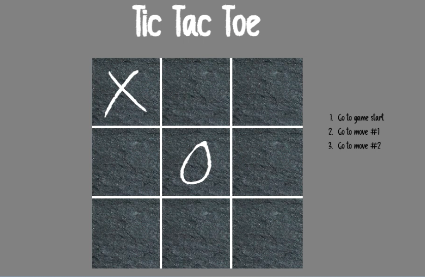

# Tic-Tac-Toe app - Play and have fun! 

### App Tic Tac Toe allows you to play the tic-tac-toe game and see the history of the moves. This app was based on my own design and is supposed to imitate writing with chalk on the blackboard.

 

### Link

- Live preview: [https://tic-tac-toe-basiakedz.netlify.app](https://tic-tac-toe-basiakedz.netlify.app)

### Written in React.js

## Getting Started with Create React App

This project was bootstrapped with [Create React App](https://github.com/facebook/create-react-app).

### Available Scripts

To setup project download or clone the repository.

In the project directory, you can run:

#### `npm install`

To start server:

#### `npm start`

Runs the app in the development mode.\
Open [http://localhost:3000](http://localhost:3000) to view it in your browser.

The page will reload when you make changes.\
You may also see any lint errors in the console.

#### `npm run build`

Builds the app for production to the `build` folder.\
It correctly bundles React in production mode and optimizes the build for the best performance.

The build is minified and the filenames include the hashes.\
Your app is ready to be deployed!

See the section about [deployment](https://facebook.github.io/create-react-app/docs/deployment) for more information.
